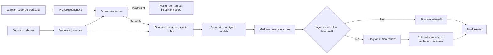

# Open-Ended Response Scoring Pipeline

This repository provides a notebook-based workflow for scoring open-ended learner responses with several large language models (LLMs). It uses course content and question metadata to create question-specific rubrics, combines model scores into a consensus score, and identifies low-agreement responses for human review.

This is research software. Validate it with your own learners, questions, and subject area before using the results for research, reporting, or educational decisions. The pipeline is designed to support qualified human judgment, not replace it.

## What is included

The repository intentionally contains only the files needed to run and understand the pipeline:

| File | Purpose |
|---|---|
| `open_ended_scoring_pipeline.ipynb` | The executable notebook. It reads inputs, builds rubrics, calls the configured models, and writes results. |
| `pipeline_config.py` | The central place to choose models and adjust scoring, batching, agreement, caching, and retry settings. |
| `requirements.txt` | Python packages required by the notebook. |
| `README.md` | This guide. |
| `.gitignore` | Prevents credentials, private input data, generated outputs, and temporary files from being added to Git. |
| `LICENSE` | The MIT license for the code. |

No learner data, course material, API keys, or example datasets are included. You provide your own local `input/` folder when running the notebook. That folder and the generated `output/` folder are ignored by Git.

## What the pipeline does



For every question, the notebook:

1. Reads the response workbook and question metadata.
2. Extracts teaching text from the course notebooks for each module and asks the configured summary model to create a module summary.
3. Pauses for you to review and approve the module summaries before scoring continues.
4. Changes the wide response workbook into one row per learner, question, and time point (`pre` or `post`).
5. Screens responses as `scorable` or `insufficient`.
6. Uses the course summary and a sample of scorable responses to create a three-level rubric for each question.
7. Sends scorable responses to every model listed in `MODEL_CONFIG["scoring_models"]`.
8. Sets `final_score` to the median of the available model scores and calculates the share of models that matched that score (`agreement`).
9. Flags scorable responses for human review when agreement is below the configured threshold.
10. Creates a final file that uses a completed human score when one has been entered; otherwise it keeps the model consensus score.

Responses screened as `insufficient` are not sent to the scoring models. They receive the configured `insufficient_score` (currently `1`) and are not automatically flagged for human review. Treat this as an assessment policy choice and change it if it does not fit your use case.

## Before you begin

You need:

- Python 3.10 or newer.
- JupyterLab or Jupyter Notebook.
- An OpenAI API key. OpenAI is used by default for course summaries, screening, and rubric generation.
- Credentials for each scoring provider you leave enabled. The default scoring configuration uses OpenAI, Amazon Bedrock Claude, and Google Vertex AI Gemini.
- Access to the selected models in the relevant cloud account and region.

Model availability, IDs, behavior, and cost can change. Confirm that the model names in `pipeline_config.py` are available to your account before running a full dataset.

## Install and open the notebook

Clone or download this repository, then run the following from its folder:

```bash
python -m venv .venv
source .venv/bin/activate
python -m pip install --upgrade pip
python -m pip install -r requirements.txt
jupyter lab
```

On Windows, activate the environment with:

```powershell
.venv\Scripts\activate
```

Open `open_ended_scoring_pipeline.ipynb` in Jupyter and run its cells from top to bottom. Start Jupyter from the repository folder: the notebook treats the current folder as its base directory.

## Add credentials safely

The notebook looks for either `llm-compare.env` or `.env` in the repository folder. Create one of those files locally; it is excluded from Git by `.gitignore`.

Use only the entries relevant to the providers you have enabled. For example:

```text
# OpenAI (required by the default summary, screening, and rubric stages)
OPENAI_API_KEY=your_key_here
OPENAI_MODEL=gpt-5.2

# Amazon Bedrock Claude (only if bedrock_claude is enabled)
AWS_REGION=us-west-2
AWS_PROFILE=your_aws_profile
AWS_BEDROCK_MODEL_ID=us.anthropic.claude-sonnet-4-5-20250929-v1:0

# Google Vertex AI Gemini (only if vertex_gemini is enabled)
GOOGLE_CLOUD_PROJECT=your_google_cloud_project
GOOGLE_CLOUD_LOCATION=global
GEMINI_MODEL=gemini-3.1-pro-preview
GOOGLE_APPLICATION_CREDENTIALS=/full/path/to/service-account.json
```

For Google authentication, the notebook also accepts `GOOGLE_APPLICATION_CREDENTIALS_JSON_B64`, a base64-encoded service-account JSON value. For Amazon Bedrock, the normal AWS credential chain works as well; `AWS_PROFILE` is optional. Never place keys, passwords, or service-account files in this repository.

## Prepare your input files

Create the following structure next to the notebook. These files stay on your computer and are not included when the repository is uploaded to GitHub.

```text
input/
├── Responses_clean.xlsx
├── question_info.csv
└── course_folder/
    ├── module_1/
    │   └── course_material.ipynb
    └── module_2/
        └── course_material.ipynb
```

The actual module folder names and notebook names are up to you. The `module_folder` value in `question_info.csv` must match the corresponding folder name under `input/course_folder/`.

### 1. Response workbook: `input/Responses_clean.xlsx`

The workbook must have a worksheet named `responses` and a column named `ID`. Each row is one learner/respondent. The other columns hold the original pre- and post-response text.

The `ID` value is carried into every output file, so use a de-identified study ID if you will send the data to external model providers. Do not use names, email addresses, or other direct identifiers unless you have appropriate approval and agreements.

A simplified layout looks like this:

| ID | q1_pre | q1_post | q2_pre | q2_post |
|---|---|---|---|---|
| 1001 | learner's pre-response | learner's post-response | learner's pre-response | learner's post-response |

The column names such as `q1_pre` and `q1_post` can be anything. You identify the correct names in `question_info.csv`.

### 2. Question metadata: `input/question_info.csv`

This CSV has one row per question and needs the following columns:

| Column | Required | Meaning |
|---|---:|---|
| `question_id` | Yes | A unique stable ID, such as `q1`. |
| `topic` | Yes | A short label used in outputs, such as `Cell biology`. |
| `pre_col` | Yes | Exact column name in `Responses_clean.xlsx` containing the pre-response. |
| `post_col` | Yes | Exact column name in `Responses_clean.xlsx` containing the post-response. |
| `question_text` | Yes | The complete question or prompt shown to learners. |
| `module_id` | Yes | The course module associated with the question. |
| `module_folder` | No | Folder name inside `input/course_folder/`. If omitted, the notebook uses `module_id`. |

Example:

```csv
question_id,topic,pre_col,post_col,question_text,module_id,module_folder
q1,Cell biology,q1_pre,q1_post,"Explain how cells obtain energy.",module_1,module_1
```

### 3. Course notebooks: `input/course_folder/`

Put one or more `.ipynb` course-material notebooks in each module folder. The notebook extracts markdown text and code comments (up to the character limits in `SCORE_CONFIG`) to provide context for summary and rubric generation. Review the resulting module summaries carefully before approving them.

## Run the workflow

1. Confirm `pipeline_config.py` contains the models and settings you want.
2. Add your local credentials file and input files as described above.
3. Start Jupyter from the repository folder and open `open_ended_scoring_pipeline.ipynb`.
4. Run every cell in order.
5. At the **Module Summary Review** checkpoint, read the displayed summaries. Enter `YES` only if they accurately describe the course content. Entering `NO` stops the workflow so you can revise the source material, summary prompt, or configuration.
6. After scoring, open `output/review/flagged_for_review.csv` and complete `human_final_score` for any responses you decide to review.
7. Rerun the notebook (or the final review/output cells) to create `scored_all_questions_final.csv`, which applies completed human scores.

The default cache settings prevent repeated model calls when the relevant files already exist. If you change inputs, course notebooks, models, prompts, or scoring settings, follow the cache guidance below before rerunning.

## Configure the pipeline

All operational settings are in `pipeline_config.py`. The notebook reloads this file when its configuration cell runs, so edit the file and rerun that cell before a new run.

### `MODEL_CONFIG`

`MODEL_CONFIG` tells the notebook which model is used at each stage.

| Setting | Default role | How to use it |
|---|---|---|
| `module_summary_model` | Summarizes course material for each module. | Set its `provider` and `model`. Default: OpenAI. |
| `screen_model` | Labels each response as `scorable` or `insufficient`. | Set its `provider` and `model`. Default: OpenAI. |
| `rubric_model` | Creates the question-specific three-level rubric. | Set its `provider` and `model`. Default: OpenAI. |
| `scoring_models` | Scores every scorable response. | This is a list. Add, remove, or edit providers/models here. |
| `max_output_tokens` | Output limit passed to model calls. | Increase only when a stage requires longer responses; higher limits can increase cost. |

Each entry in `scoring_models` has three fields:

| Field | Meaning |
|---|---|
| `name` | Output-column prefix. For example, `openai_gpt` becomes `openai_gpt_score`. Keep names unique. |
| `provider` | The notebook’s provider wrapper. The included values are `openai`, `aws_bedrock_claude`, and `gcp_vertex_gemini`. |
| `model` | The provider’s model identifier. Environment variables can override the default model names without changing the Python file. |

If you only want one or two scoring models, remove the other entries from `scoring_models`. With one model, its score becomes the final score and agreement will be `1.0`; this means no rows will be flagged based on model disagreement.

### `SCORE_CONFIG`

`SCORE_CONFIG` controls the scale and how the workflow behaves.

| Setting | Current value | Effect |
|---|---:|---|
| `scale_min`, `scale_max` | `1`, `3` | The fixed numeric score range used by the generated rubric and model outputs. Change both only if you also adapt the notebook’s scoring schemas/prompts. |
| `score_labels` | Beginner / Intermediate / Advanced | Labels used beside scores 1, 2, and 3 in final outputs. |
| `insufficient_score`, `insufficient_label` | `1`, `Beginner` | Score assigned to responses classified as insufficient. |
| `rubric_sample_prop` | `1.0` | Proportion of scorable responses eligible for rubric sampling. |
| `rubric_sample_min_n` | `0` | Minimum sampled scorable responses per question. |
| `rubric_sample_max_n` | `1000` | Maximum sampled scorable responses per question. Lower it to control cost or exposure of response text. |
| `rubric_sample_random_state` | `42` | Seed for repeatable rubric sampling. It does not make model output deterministic. |
| `screen_batch_size` | `80` | Number of responses sent in one screening request. |
| `scoring_batch_size` | `80` | Number of scorable responses sent in one scoring request per model. |
| `agreement_threshold` | `0.60` | A scorable response is flagged when the fraction of models matching the median score is below this value. |
| `sleep_between_calls_sec` | `0.0` | Pause after each model’s scoring pass. Increase when working within API rate limits. |
| `max_workers` | `3` | Number of scoring batches processed concurrently. Reduce it if the provider rate-limits requests. |
| `fallback_max_retries` | `1` | Retry count before the notebook splits a failed batch into smaller batches. |
| `max_markdown_chars_per_notebook` | `12000` | Maximum markdown text read from each course notebook. |
| `max_code_comment_chars_per_notebook` | `2000` | Maximum code-comment text read from each course notebook. |
| `overwrite_module_summaries` | `False` | Set to `True` to regenerate saved module summaries. |
| `overwrite_question_outputs` | `False` | Set to `True` to regenerate screening, rubric, and scoring outputs. |

### When to overwrite cached results

Set `overwrite_module_summaries = True` when you change course notebooks, module-folder mapping, the summary model, or the summary prompt in the notebook.

Set `overwrite_question_outputs = True` when you change response data, question text, scoring models, rubric settings, screening/scoring prompts, or other scoring settings. Change the setting back to `False` after the fresh run if you want future reruns to reuse results.

## Files created by a run

The notebook creates `output/` automatically. Its most useful artifacts are:

| Path | Contents |
|---|---|
| `output/module_summaries/module_summaries.json` | Course-context summaries used for each module. |
| `output/screen/screened_<question_id>.csv` | Screening results for one question. |
| `output/rubrics/rubric_<question_id>.json` | Generated question-specific rubric. |
| `output/results/scored_<question_id>.csv` | Model scores for one question. |
| `output/results/scored_all_questions.csv` | Combined model-consensus results before completed human review. |
| `output/review/flagged_for_review.csv` | Low-agreement responses, with blank human-review columns. |
| `output/results/scored_all_questions_final.csv` | Final combined results, using a valid human score when present. |
| `output/qc/api_usage_<run_id>.csv` | Token and latency details for the current run. |
| `output/qc/api_usage_log.jsonl` | Append-only API usage history. |

The combined results include the original respondent ID, question metadata, normalized response text, screening label, one `<model_name>_score` column per configured scorer, `final_score`, `final_label`, `agreement`, and `review_flag`.

For rows in `flagged_for_review.csv`, fill in:

| Column | What to enter |
|---|---|
| `human_final_score` | A valid score from the configured range—currently 1, 2, or 3. |
| `human_review_note` | Optional explanation for the decision. |
| `human_reviewer` | Optional reviewer name or initials. |
| `human_review_date` | Optional review date. |

When a valid `human_final_score` is present, the final output writes it to `final_score_after_qc`, updates the label, and sets `human_review_completed` to `True`.

## Privacy, cost, and responsible use

Learner responses and course materials can contain protected or sensitive information. Before running the notebook:

- De-identify response data whenever possible.
- Confirm institutional approval, participant consent, data-use agreements, and provider terms.
- Verify each provider’s data handling, retention, and geographic processing practices.
- Keep the local `input/` and `output/` folders access-controlled.
- Pilot on a small, de-identified dataset and inspect rubrics, scores, disagreements, and error patterns before a larger run.

The notebook may make many API calls: module summaries, screening batches, rubric generation, and one scoring pass per configured model. Cost depends on the number and length of responses, course-material length, sampling settings, enabled models, retries, and reruns. Check `output/qc/` after each run.

## Common issues

| Message or symptom | Likely cause and solution |
|---|---|
| `Input file not found` | Create `input/Responses_clean.xlsx` and `input/question_info.csv` exactly at those paths. |
| Expected an `ID` column | Add an `ID` column to the `responses` worksheet. |
| Missing required columns in `question_info.csv` | Add the required headers exactly as shown in the input table. |
| OpenAI client is not configured | Add `OPENAI_API_KEY` to `.env` or `llm-compare.env`, then rerun the credential cell. |
| Google project is not set | Add `GOOGLE_CLOUD_PROJECT` and configure Google authentication. |
| Provider errors or rate limits | Confirm credentials/model access; reduce batch sizes or `max_workers`, and increase `sleep_between_calls_sec`. |
| Old outputs are reused after a change | Turn on the appropriate `overwrite_*` setting in `pipeline_config.py` and rerun. |

## License

The code is available under the [MIT License](LICENSE). The license covers this repository’s code only—not your learner data, course materials, generated outputs, model-provider services, or third-party content.
